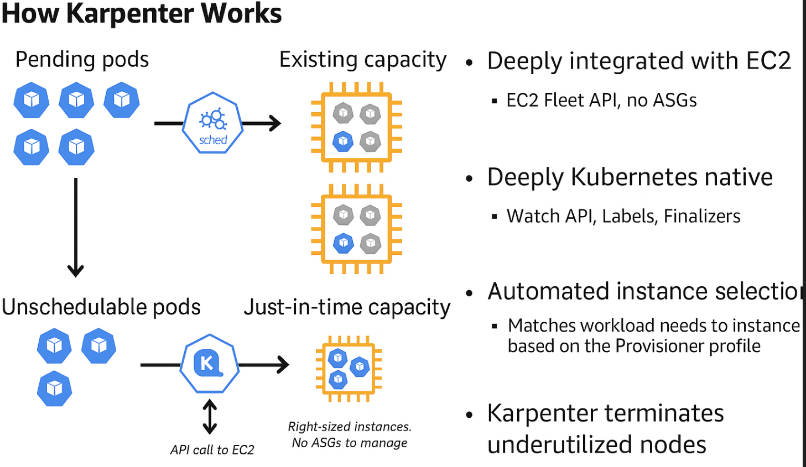
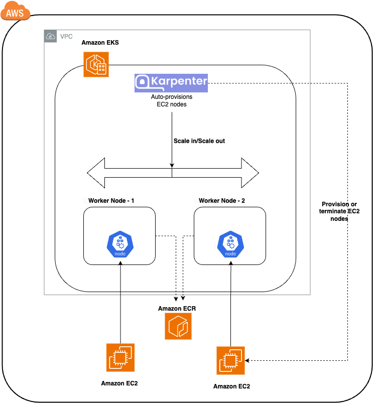
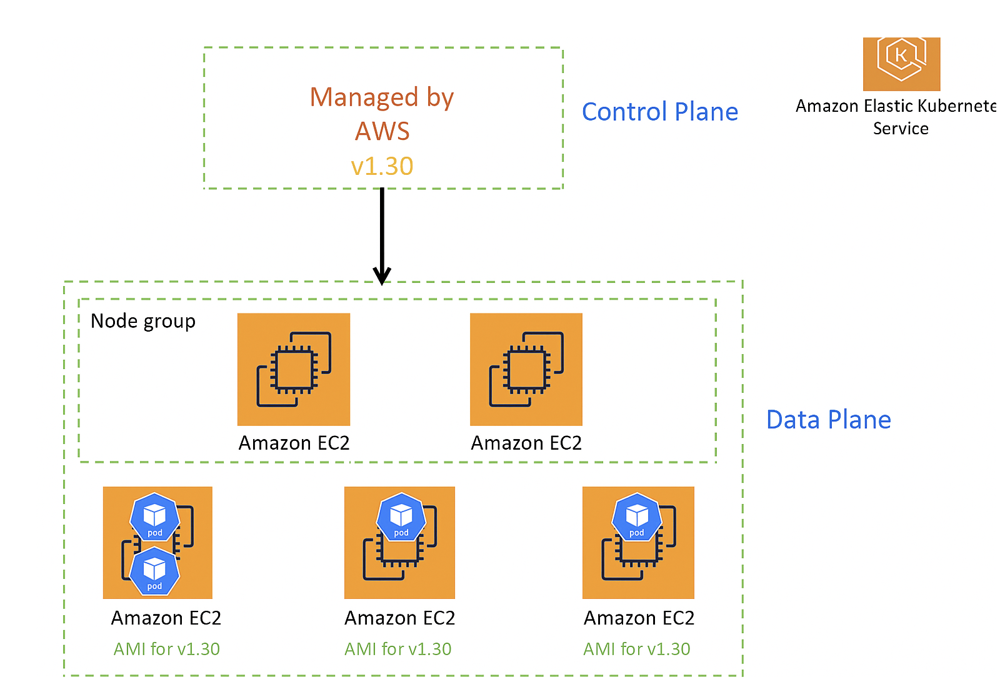
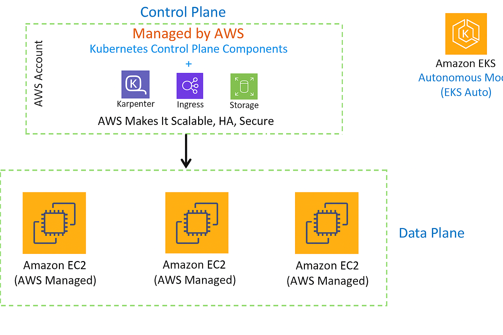
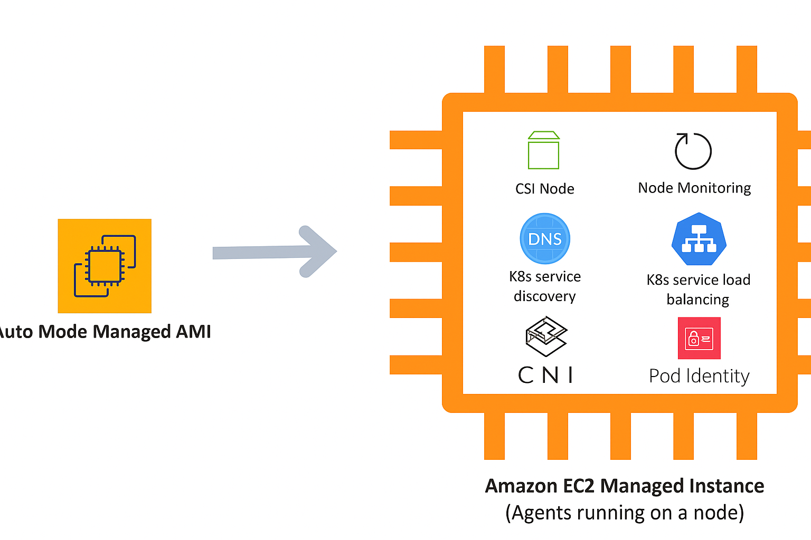

### Why Karpenter?

- It is a valuable tool for automating and optimizing node management in Kubernetes clusters, providing better resource utilization, scalability, and reliability. That's why it helps to reduce the cost as well.

### How it works? (7*)

-  After installation, Karpenter monitors unschedulable Pods in the cluster. Provisioning new Nodes requires at least one NodePool, which introduces the concept of NodeClass.
   - NodeClass is set of AWS-specific configurations such as AMI, resource tags, EBS mappings, etc.
   - NodePool is a set of Node requirements: Availability Zone, CPU amount, Instance family, etc

- Karpenter actively monitors free Node capacity, rescheduling existing Pods to minimize the provisioned Node capacity.

-  (8*)


-  (11*)


### Installation and Demo


####  1. Set environment variables

```
export KARPENTER_NAMESPACE="kube-system"
export KARPENTER_VERSION="1.2.1"
export K8S_VERSION="1.31"
export AWS_PARTITION="aws" 
export CLUSTER_NAME="eks-demo"
export AWS_DEFAULT_REGION="eu-west-1"
export AWS_ACCOUNT_ID="$(aws sts get-caller-identity --query Account --output text)"
export TEMPOUT="$(mktemp)"
export ARM_AMI_ID="$(aws ssm get-parameter --name /aws/service/eks/optimized-ami/${K8S_VERSION}/amazon-linux-2-arm64/recommended/image_id --query Parameter.Value --output text)"
export AMD_AMI_ID="$(aws ssm get-parameter --name /aws/service/eks/optimized-ami/${K8S_VERSION}/amazon-linux-2/recommended/image_id --query Parameter.Value --output text)"
export GPU_AMI_ID="$(aws ssm get-parameter --name /aws/service/eks/optimized-ami/${K8S_VERSION}/amazon-linux-2-gpu/recommended/image_id --query Parameter.Value --output text)"
```


####  2. Create EKS Cluster 
```
curl -fsSL https://raw.githubusercontent.com/aws/karpenter-provider-aws/v"${KARPENTER_VERSION}"/website/content/en/preview/getting-started/getting-started-with-karpenter/cloudformation.yaml  > "${TEMPOUT}" \
&& aws cloudformation deploy \
  --stack-name "Karpenter-${CLUSTER_NAME}" \
  --template-file "${TEMPOUT}" \
  --capabilities CAPABILITY_NAMED_IAM \
  --parameter-overrides "ClusterName=${CLUSTER_NAME}"

eksctl create cluster -f - <<EOF
---
apiVersion: eksctl.io/v1alpha5
kind: ClusterConfig
metadata:
  name: ${CLUSTER_NAME}
  region: ${AWS_DEFAULT_REGION}
  version: "${K8S_VERSION}"
  tags:
    karpenter.sh/discovery: ${CLUSTER_NAME}

iam:
  withOIDC: true
  podIdentityAssociations:
  - namespace: "${KARPENTER_NAMESPACE}"
    serviceAccountName: karpenter
    roleName: ${CLUSTER_NAME}-karpenter
    permissionPolicyARNs:
    - arn:${AWS_PARTITION}:iam::${AWS_ACCOUNT_ID}:policy/KarpenterControllerPolicy-${CLUSTER_NAME}

iamIdentityMappings:
- arn: "arn:${AWS_PARTITION}:iam::${AWS_ACCOUNT_ID}:role/KarpenterNodeRole-${CLUSTER_NAME}"
  username: system:node:{{EC2PrivateDNSName}}
  groups:
  - system:bootstrappers
  - system:nodes

managedNodeGroups:
- instanceType: m4.large
  amiFamily: AmazonLinux2
  name: ${CLUSTER_NAME}-ng
  desiredCapacity: 1
  minSize: 1
  maxSize: 2

addons:
- name: eks-pod-identity-agent
EOF

export CLUSTER_ENDPOINT="$(aws eks describe-cluster --name "${CLUSTER_NAME}" --query "cluster.endpoint" --output text)"
export KARPENTER_IAM_ROLE_ARN="arn:${AWS_PARTITION}:iam::${AWS_ACCOUNT_ID}:role/${CLUSTER_NAME}-karpenter"

echo "${CLUSTER_ENDPOINT} ${KARPENTER_IAM_ROLE_ARN}"

```

####  2.1. Check:

#####  2.1.1. Run the following command and get the IAM role of the vpc-cni:

```eksctl get addons --cluster $CLUSTER_NAME```

Like: arn:aws:iam::<account-id>:role/<role_name>

#####  2.1.2. Run the following command to list all policies attached to the role:

```aws iam list-attached-role-policies --role-name <role_name>```

If AmazonEKS_CNI_Policy policy is not attached to the role, then run the following to attach the policy:

``` 
aws iam attach-role-policy \
  --role-name  arn:aws:iam::637423429881:role/eksctl-eks-demo-1-addon-vpc-cni-Role1-zSsBzT6TU7SV \
  --policy-arn arn:aws:iam::aws:policy/AmazonEKS_CNI_Policy
```

####  3. Install Karpenter NodePool

 ```
helm registry logout public.ecr.aws

helm upgrade --install karpenter oci://public.ecr.aws/karpenter/karpenter --version "${KARPENTER_VERSION}" --namespace "${KARPENTER_NAMESPACE}" --create-namespace \
  --set "settings.clusterName=${CLUSTER_NAME}" \
  --set "settings.interruptionQueue=${CLUSTER_NAME}" \
  --set controller.resources.requests.cpu=1 \
  --set controller.resources.requests.memory=1Gi \
  --set controller.resources.limits.cpu=1 \
  --set controller.resources.limits.memory=1Gi \
  --wait
 ```
####  4. Create NodePool

```
cat <<EOF | envsubst | kubectl apply -f -
apiVersion: karpenter.sh/v1
kind: NodePool
metadata:
  name: default
spec:
  template:
    spec:
      requirements:
        - key: kubernetes.io/arch
          operator: In
          values: ["amd64"]
        - key: kubernetes.io/os
          operator: In
          values: ["linux"]
        - key: karpenter.sh/capacity-type
          operator: In
          values: ["spot", "on-demand"]
        - key: karpenter.k8s.aws/instance-category
          operator: In
          values: ["c", "m", "r"]
      nodeClassRef:
        group: karpenter.k8s.aws
        kind: EC2NodeClass
        name: default
      expireAfter: 720h # 30 * 24h = 720h
  limits:
    cpu: 200
  disruption:
    consolidationPolicy: WhenEmptyOrUnderutilized
    consolidateAfter: 1m
---
apiVersion: karpenter.k8s.aws/v1
kind: EC2NodeClass
metadata:
  name: default
spec:
  amiFamily: AL2 # Amazon Linux 2
  role: "KarpenterNodeRole-${CLUSTER_NAME}" # replace with your cluster name
  subnetSelectorTerms:
    - tags:
        karpenter.sh/discovery: "${CLUSTER_NAME}" # replace with your cluster name
  securityGroupSelectorTerms:
    - tags:
        karpenter.sh/discovery: "${CLUSTER_NAME}" # replace with your cluster name
  amiSelectorTerms:
    - id: "${ARM_AMI_ID}"
    - id: "${AMD_AMI_ID}"
EOF
```

####  5. Demo: Automatic Node Provisioning

 - ```kubectl apply -f deployment.yaml```

- ```kubectl scale deployment nginx-deployment --replicas 10```

- ```kubectl scale deployment nginx-deployment --replicas 20```

- ```kubectl scale deployment nginx-deployment --replicas 1```

- ```kubectl scale deployment nginx-deployment --replicas 0```

#### EKS Node Viewer (9*)

- You can use eks-node-viewer to visualize node usage and how pods are scheduled in the cluster. 

- eks-node-viewer is a tool for visualizing dynamic node usage within a cluster. 
  - It displays the scheduled pod resource requests vs the allocatable capacity on the node. 
  - It does not look at the actual pod resource usage.

- Installation
  - brew tap aws/tap
  - brew install eks-node-viewer

- Usage
  - eks-node-viewer

####  7. After the tests - Delete all the AWS Resources that we have created

*!!! DO NOT FORGET to clean up your AWS resources after testing to avoid unnecessary costs.*

```  
helm uninstall karpenter --namespace "${KARPENTER_NAMESPACE}"
aws cloudformation delete-stack --stack-name "Karpenter-${CLUSTER_NAME}"
aws ec2 describe-launch-templates --filters "Name=tag:karpenter.k8s.aws/cluster,Values=${CLUSTER_NAME}" |
    jq -r ".LaunchTemplates[].LaunchTemplateName" |
    xargs -I{} aws ec2 delete-launch-template --launch-template-name {}
eksctl delete cluster --name "${CLUSTER_NAME}"
 ```

##  EKS with Self-Managed Karpenter vs EKS Auto Mode (12*)

- 
  - Before deploying your workload, you are responsible for:
    - Installing and managing necessary Kubernetes add-ons (e.g., CoreDNS, kube-proxy).
    - Managing the worker nodes, including selecting the appropriate Amazon Machine Image (AMI) version for compatibility.
  - When upgrading the control plane:
    - After AWS upgrades the control plane, you must manually test and upgrade both the add-ons and the worker node AMIs to ensure compatibility and cluster stability.
- With EKS Auto Mode:
  - These operational responsibilities (add-on management, AMI selection, and worker node lifecycle) are fully handled by AWS), allowing you to focus on your applications instead of infrastructure management.
  - 

- In EKS Auto, workloads run on AWS managed EC2 instances using a specialized AMI (Bottlerocket AMI). 
  - 
- This Auto Mode Managed AMI comes with several critical Kubernetes components pre-installed and tightly integrated into the system image.
  - (i.e pod Identity, core DNS , VPC CNI etc)
- In these components do not run as a DeamonSet, they run systemd processes. These make them little bit lightweigjt and more scalable.
- Unlike traditional EKS setups, where such components often run as DaemonSets, in EKS Auto mode they operate as systemd services directly on the host OS. This design:
 - Improves startup time
 - Enhances scalability


| Feature                                           | EKS with Self-Managed Karpenter                                  | EKS Auto                                                                 |
|---------------------------------------------------|------------------------------------------------------------------|--------------------------------------------------------------------------|
| Karpenter & Addons Management                    | You manage Karpenter and other addons                           | AWS manages Karpenter and core addons (EBS CSI, LB Controller)           |
| Worker Node Management                           | You manage worker nodes                                         | AWS manages worker nodes                                                 |
| AMI Options                                      | Can use any EKS Optimized or custom AMIs                        | Bottlerocket AMI is used                                                 |
| Worker Node Lifecycle                            | Run indefinitely (not recommended) or choose custom hours/days  | Worker nodes will recycle after max 21 days (default 14)                |
| Rightsizing & Cost Optimization                  | Automatically rightsizes and optimizes cost                     | Automatically rightsizes and optimizes cost                              |
| Data Plane & Addon Upgrade                       | You decide when to upgrade; need to test and update addons      | AWS automatically upgrades data plane and updates working addons         |
| Cost                                             | No additional cost, OSS Karpenter is free                       | Additional 12% On-Demand EC2 cost                                        |


### When to Use: EKS with Self-Managed Karpenter vs EKS Auto

| Criteria / Use Case                                                                 | EKS with Self-Managed Karpenter                                 | EKS Auto                                                                 |
|-------------------------------------------------------------------------------------|------------------------------------------------------------------|--------------------------------------------------------------------------|
| Kubernetes Knowledge                                                                | Have in-house Karpenter knowledge                               | No need for in-house Karpenter knowledge                                 |
| Platform Team Availability                                                          | Have a platform team to manage cluster and addons               | No platform team needed; focus on delivering business value              |
| AMI and Node Expiry Requirements                                                    | Require custom AMI or non-expiring worker nodes                 | No nuanced requirements for custom AMI or non-expiring worker nodes      |
| Speed to Market                                                                     | Not focused on immediate go-to-market                           | Want to go to market as fast as possible with Kubernetes                 |


### Resources
1* https://karpenter.sh/

2* https://github.com/aws/karpenter

3* [Kubernetes Node Autoscaling with Karpenter (AWS EKS & Terraform) - Anton Putra - Youtube](https://www.youtube.com/watch?v=C_YZXpXwtbg)

4* [Kubernetes Node Autoscaling with Karpenter (AWS EKS & Terraform) - Anton Putra - Blog](https://antonputra.com/amazon/kubernetes-node-autoscaling-with-karpenter/#demo-automatic-node-provisioning)

5* [Karpenter vs Kubernetes Cluster Autoscaler - Justin Garrison](https://www.youtube.com/watch?v=3QsVRHVdOnM)

6* [Karpenter for Kubernetes | Karpenter vs Cluster Autoscaler](https://www.youtube.com/watch?v=FIBc8GkjFU0)

7* [Fine-Tuning EKS Clusters with Karpenter: DevOps Insights - Yevhen Chemerys](https://medium.com/@yevvhen/fine-tuning-eks-clusters-with-karpenter-devops-insights-159689e5160e)

8* [Karpenter: EKS Cluster Autoscaling](https://www.youtube.com/watch?v=PtsKPlYw3f4&t=1190s)

9* https://github.com/awslabs/eks-node-viewer

10* [Karpenter for Kubernetes Tutorial with Demo - Cloud with Raj](https://www.youtube.com/watch?v=cc2leue9P3s)

11* https://aircall.io/blog/tech-team-stories/scale-karpenter-zero-optimize-costs/

12* [Kubernetes Karpenter Vs AWS EKS Auto - Cloud With Raj](https://www.youtube.com/watch?v=WtL6WHQldYc)