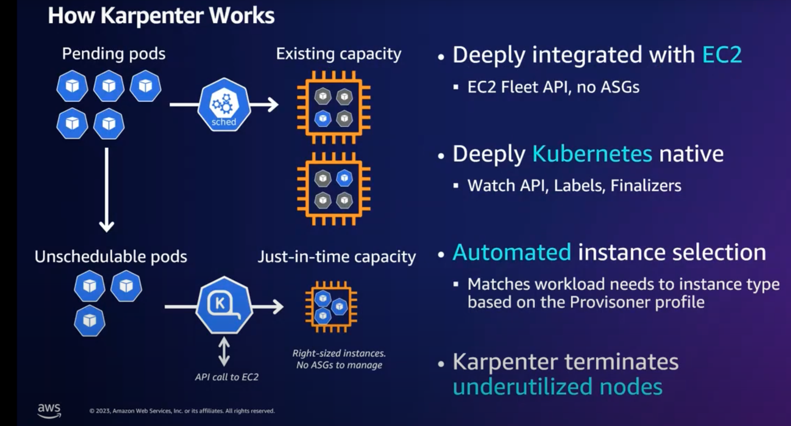

# WIP

### Why Karpenter?

- It is a valuable tool for automating and optimizing node management in Kubernetes clusters, providing better resource utilization, scalability, and reliability. That's why it helps to reduce the cost as well.

### How it works? (7*)

-  After installation, Karpenter monitors unschedulable Pods in the cluster. Provisioning new Nodes requires at least one NodePool, which introduces the concept of NodeClass.
   - NodeClass is set of AWS-specific configurations such as AMI, resource tags, EBS mappings, etc.
   - NodePool is a set of Node requirements: Availability Zone, CPU amount, Instance family, etc

- Karpenter actively monitors free Node capacity, rescheduling existing Pods to minimize the provisioned Node capacity.

-  (8*)

###  1. Create AWS VPC ( [00-05] terraform files)

  - terraform init

  - terraform apply

###  2. Create EKS Cluster and a Node group ( [06-07] terraform files)

  - terraform apply

  - to connect to the cluster you need to update the Kubernetes context:


     - aws eks update-kubeconfig --name test --region eu-north-1

###  3. Create Karpenter Controller IAM Role ( [08-09] terraform files and controller-trust-policy.json file)

  - terraform init

  - terraform apply

###  4. Deploy Karpenter to EKS ( [10] terraform file)

  - terraform apply

  - Check if the helm has been deployed successfully.

     - 
       ```
       helm list -A
       NAME     	NAMESPACE	REVISION	UPDATED                                 	STATUS  	CHART           	APP VERSION
       karpenter	karpenter	1       	2023-10-13 16:08:27.073106337 +0200 CEST	deployed	karpenter-0.16.3	0.16.3
       ```    


###  5. Create Karpenter Provisioner

 ```kubectl apply -f provisioner.yaml```


###  6. Demo: Automatic Node Provisioning

 ```kubectl apply -f deployment.yaml```

  - A new node that has 5 new pods will be created.

###  7. After the tests - Delete all the AWS Resources that we have created

  - terraform plan -destroy

  - terraform apply -destroy

### Resources
1* https://karpenter.sh/

2* https://github.com/aws/karpenter

3* [Kubernetes Node Autoscaling with Karpenter (AWS EKS & Terraform) - Anton Putra - Youtube](https://www.youtube.com/watch?v=C_YZXpXwtbg)

4* [Kubernetes Node Autoscaling with Karpenter (AWS EKS & Terraform) - Anton Putra - Blog](https://antonputra.com/amazon/kubernetes-node-autoscaling-with-karpenter/#demo-automatic-node-provisioning)

5* [Karpenter vs Kubernetes Cluster Autoscaler - Justin Garrison](https://www.youtube.com/watch?v=3QsVRHVdOnM)

6* [Karpenter for Kubernetes | Karpenter vs Cluster Autoscaler](https://www.youtube.com/watch?v=FIBc8GkjFU0)

7* [Fine-Tuning EKS Clusters with Karpenter: DevOps Insights - Yevhen Chemerys](https://medium.com/@yevvhen/fine-tuning-eks-clusters-with-karpenter-devops-insights-159689e5160e)

8* [Karpenter: EKS Cluster Autoscaling](https://www.youtube.com/watch?v=PtsKPlYw3f4&t=1190s)